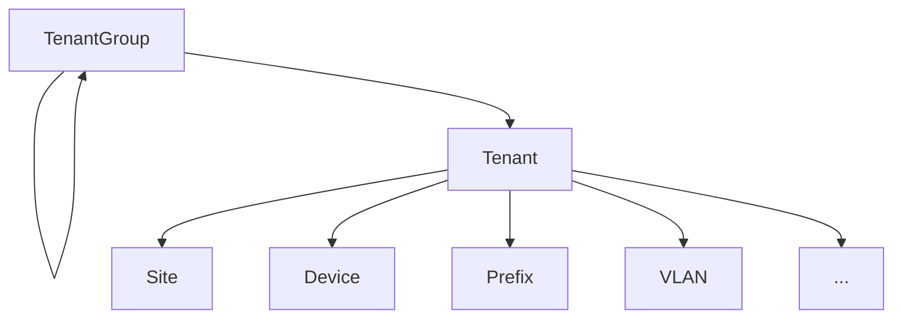
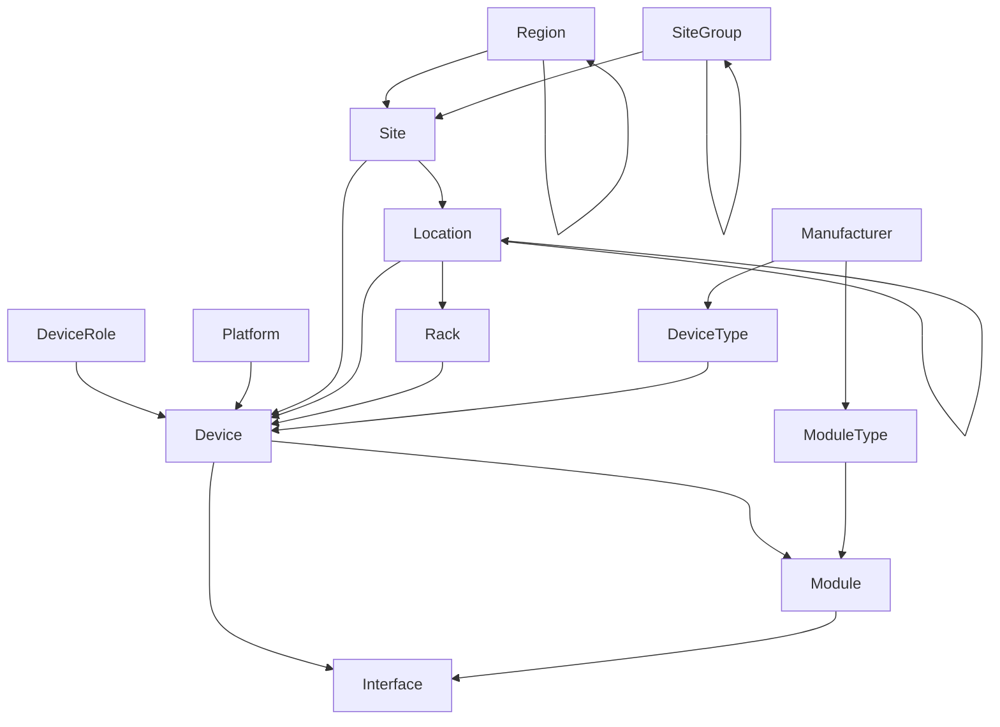
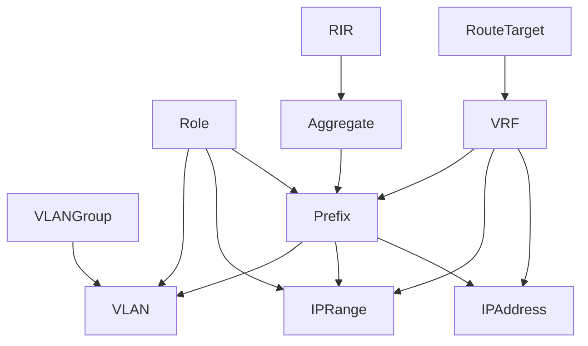
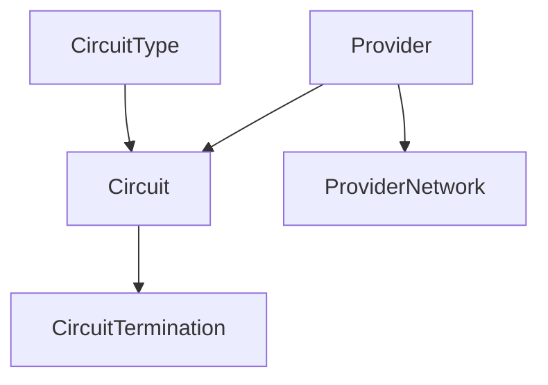
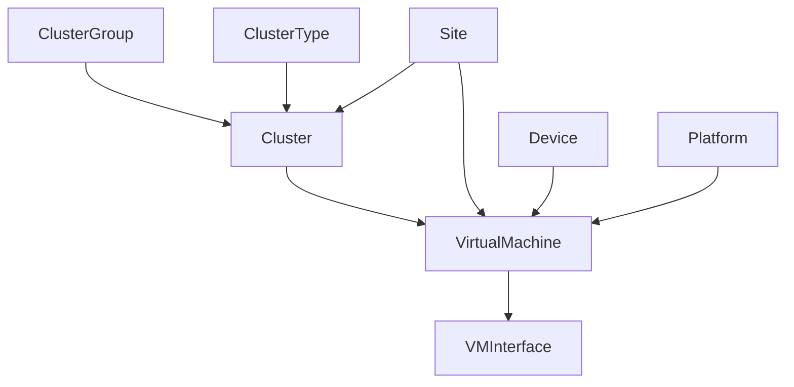

# Planning Your Move

This guide outlines the steps necessary for planning a successful migration to NetPoint. Although it is written under the context of a completely new installation, the general approach outlined here works just as well for adding new data to existing NetPoint deployments.

## Identify Current Sources of Truth

Before beginning to use NetPoint for your own data, it's crucial to first understand where your existing sources of truth reside. A "source of truth" is really just any repository of data that is authoritative for a given domain. For example, you may have a spreadsheet which tracks all IP prefixes in use on your network. So long as everyone involved agrees that this spreadsheet is _authoritative_ for the entire network, it is your source of truth for IP prefixes.

Anything can be a source of truth, provided it meets two conditions:

1. It is agreed upon by all relevant parties that this source of data is correct.
2. The domain to which it applies is well-defined.

<!-- TODO: Example SoT -->

Dedicate some time to take stock of your own sources of truth for your infrastructure. Upon attempting to catalog these, you're very likely to encounter some challenges, such as:

* **Multiple conflicting sources** for a given domain. For example, there may be multiple versions of a spreadsheet circulating, each of which asserts a conflicting set of data.
* **Sources with no domain defined.** You may encounter that different teams within your organization use different tools for the same purpose, with no normal definition of when either should be used.
* **Inaccessible data formatting.** Some tools are better suited for programmatic usage than others. For example, spreadsheets are generally very easy to parse and export, however free-form notes on wiki or similar application are much more difficult to consume.
* **There is no source of truth.** Sometimes you'll find that a source of truth simply doesn't exist for a domain. For example, when assigning IP addresses, operators may be just using any (presumed) available IP from a subnet without ever recording its usage.

See if you can identify each domain of infrastructure data for your organization, and the source of truth for each. Once you have these compiled, you'll need to determine what belongs in NetPoint.

## Determine What to Move

The general rule when determining what data to put into NetPoint is this: If there's a model for it, it belongs in NetPoint. For instance, NetPoint has purpose-built models for racks, devices, cables, IP prefixes, VLANs, and so on. These are very straightforward to use. However, you'll inevitably reach the limits of NetPoint's data model and question what additional data might make sense to record in NetPoint. For example, you might wonder whether NetPoint should function as the source of truth for infrastructure DNS records or DHCP scopes.

NetPoint provides two core mechanisms for extending its data model. The first is custom fields: Most models in NetPoint support the addition of custom fields to hold additional data for which a built-in field does not exist. For example, you might wish to add an "inventory ID" field to the device model. The second mechanism is plugins. Users can create their own plugins to introduce entirely new models, views, and API endpoints in NetPoint. This can be incredibly powerful, as it enables rapid development and tight integration with core models.

That said, it doesn't always make sense to migrate a domain of data to NetPoint. For example, many organizations opt to use only the IPAM components or only the DCIM components of NetPoint, and integrate with other sources of truth for different domains. This is an entirely valid approach (so long as everyone involved agrees which tool is authoritative for each domain). Ultimately, you'll need to weigh the value of having non-native data models in NetPoint against the effort required to define and maintain those models.

Consider also that NetPoint is under constant development. Although the current release might not support a particular type of object, there may be plans to add support for it in a future release. (And if there aren't, consider submitting a feature request citing your use case.)

## Validate Existing Data

The last step before migrating data to NetPoint is the most crucial: **validation**. The GIGO (garbage in, garbage out) principle is in full effect: Your source of truth is only as good as the data it holds. While NetPoint has very powerful data validation tools (including support for custom validation rules), ultimately the onus falls to a human operator to assert what is correct and what is not. For example, NetPoint can validate the connection of a cable between two interfaces, but it cannot say whether the cable _should_ be there.

Here are some tips to help ensure you're only importing valid data into NetPoint:

* Ensure you're starting with complete, well-formatted data. JSON or CSV is highly recommended for the best portability.
* Consider defining custom validation rules in NetPoint prior to import. (For example, to enforce device naming schemes.)
* Use custom scripts to automatically populate patterned data. (For example, to automatically create a set of standard VLANs for each site.)

There are several methods available to import data into NetPoint, which we'll cover in the next section.

## Order of Operations

When starting with a completely empty database, it might not be immediately clear where to begin. Many models in NetPoint rely on the advance creation of other types. For example, you cannot create a device type until after you have created its manufacturer.

Below is the (rough) recommended order in which NetPoint objects should be created or imported. While it is not required to follow this exact order, doing so will help ensure the smoothest workflow.

1. Tenant groups and tenants
2. Regions, site groups, sites, and locations
3. Rack roles and racks
4. Manufacturers, device types, and module types
5. Platforms and device roles
6. Devices and modules
7. Providers, provider accounts, and provider networks
8. Circuit types and circuits
9. Wireless LAN groups and wireless LANs
10. Route targets and VRFs
11. RIRs and aggregates
12. IP/VLAN roles
13. Prefixes, IP ranges, and IP addresses
14. VLAN groups and VLANs
15. Cluster types, cluster groups, and clusters
16. Virtual machines and VM interfaces

This is not a comprehensive list, but should suffice for the initial data imports. Beyond these, it the order in which objects are added doesn't have much if any impact.

The graphs below illustrate some of the core dependencies among different models in NetPoint for your reference.

!!! note "Self-Nesting Models"
    Each model in the graphs below which show a looping arrow pointing back to itself can be nested in a recursive hierarchy. For example, you can have regions representing both countries and cities, with the latter nested underneath the former.

### Tenancy

### Sites, Racks, and Devices

### VRFs, Prefixes, IP Addresses, and VLANs

### Circuits

### Clusters and Virtual Machines

